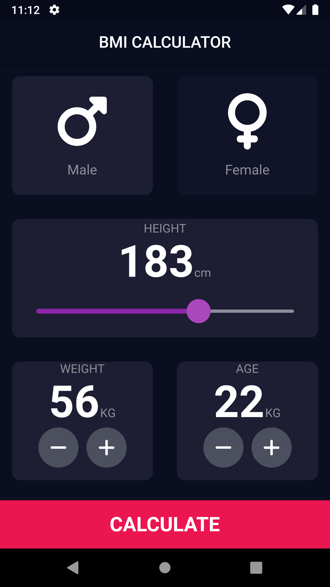

# bmi_calculator

Flutter app for calculating BMI according to Height, Weight, Age & Gender .

## Getting Started
To build and run this project:

1. Get Flutter [here](https://flutter.dev) if you don't already have it
2. Clone this repository.
3. `cd` into the repo folder.
4. run `flutter run-android` or `flutter run-ios` to build the app.

(Please note that a Mac with XCode is required to build for iOS)

## APP SAMPLES

 
 | [**Test-1**]     | [**Result-1**]    | 
|------------|-------------| 
|   |   |

 | [**Test-2**]     | [**Result-2**]    | 
|------------|-------------| 
|   |   |

 | [**Test-3**]     | [**Result-3**]    | 
|------------|-------------| 
|   |   |
